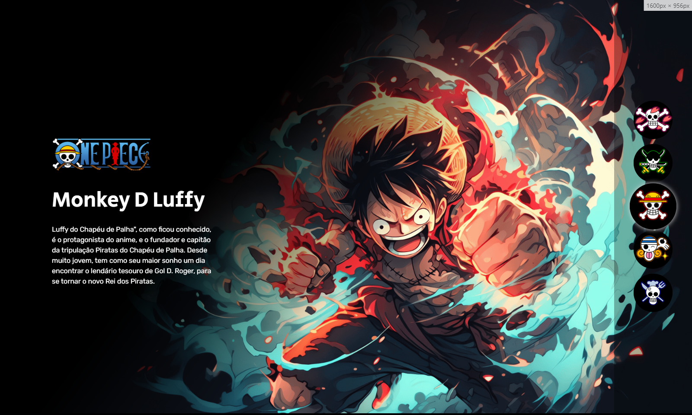
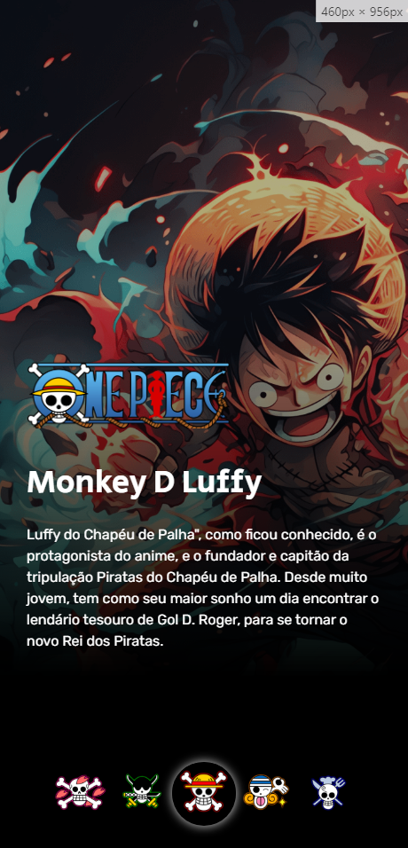

# Projeto X-Men
- Projeto criado na Semana do Zero ao Programador contratado.

## O site
- É um site com uma única página mostrando alguns dos personagens de X-Men e ao passar o mouse sobre os personagens, mostra uma imagem maior e algumas informações deles.

## Prints
- Versão desktop

- Versão mobile

## Link

- Live Site: (https://teoniuvilarinho.github.io/projeto-one-piece/)
